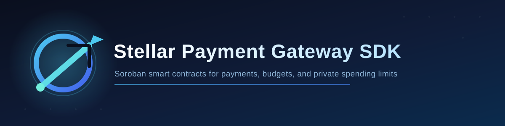
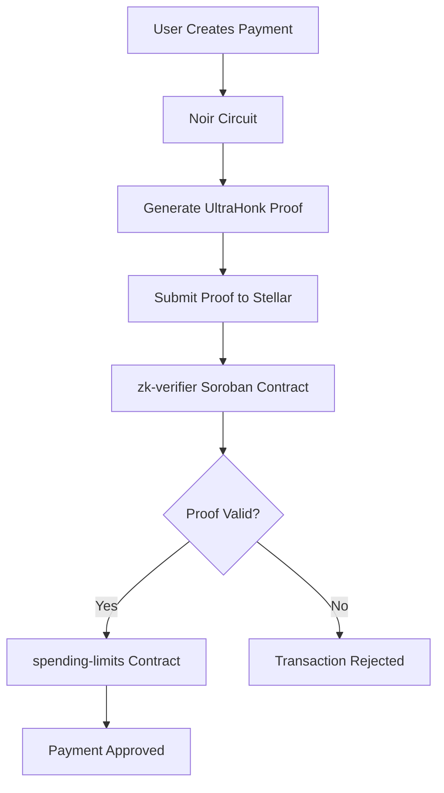
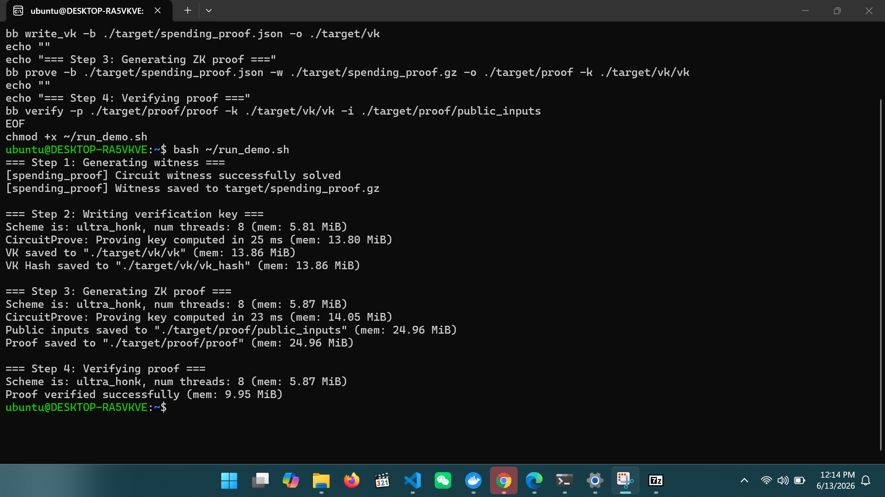

# Stellar Payment Gateway SDK

[](https://github.com/stellar-payment-gateway/stellar-payment-gateway-sdk/actions/workflows/contract-ci.yml)
[](https://github.com/stellar-payment-gateway/stellar-payment-gateway-sdk/actions/workflows/budget-tests.yml)
[](LICENSE)
[](https://github.com/stellar-payment-gateway/stellar-payment-gateway-sdk/releases)
[](rust-toolchain.toml)
[](docs/)



> Soroban smart contracts for automated budgets, savings goals, and private spending limit verification on Stellar.

**Zero-knowledge spending limits** — We integrated on-chain zero-knowledge proof verification into our spending limits contract. Users can prove a payment is within their limit without revealing the actual amount.

---

## Key Features

* Privacy-preserving spending limits
* UltraHonk proof verification
* Soroban smart contract integration
* Automated budget controls
* Savings goals
* Escrow services
* Open-source Stellar infrastructure

---

## Problem

When spending limits are enforced on Stellar, payment amounts are visible on-chain. Anyone can see them. For users in emerging markets handling sensitive financial data, this is a real privacy problem that reduces trust and adoption.

---

## Solution

We integrated zero-knowledge proofs into our spending limits contract.

> **Without a valid ZK proof, the spending authorization contract rejects the transaction. ZK is load-bearing — not decorative.**

Users generate a proof off-chain that cryptographically proves their payment is within their spending limit. The proof is verified by a Soroban smart contract on Stellar. The payment amount never appears on-chain.

---

## Architecture Diagram



---

## Proof Generation Example

The spending proof circuit successfully generates and verifies a zero-knowledge proof locally using Noir and Barretenberg.



---

## On-Chain Verification

The generated UltraHonk proof is submitted to the `zk-verifier` Soroban contract.

The verifier contract validates the proof before the `spending-limits` contract authorizes a payment.

Without successful verification, the transaction is rejected.

---

## How ZK Works

```text
User wants to make a payment
          ↓
[Off-chain] Noir circuit generates ZK proof
  Private inputs: payment_amount, spending_limit
  Public output: proof (amount stays hidden)
          ↓
Proof submitted to Stellar testnet
          ↓
[On-chain] zk-verifier Soroban contract
  verifies the proof using UltraHonk
          ↓
spending-limits contract enforces decision
          ↓
  Approved ✅ or Rejected ❌
  (payment amount never revealed on-chain)
```

---

## How Stellar Is Used

* ZK proof is verified inside a **Soroban smart contract** deployed on Stellar
* The `zk-verifier` contract connects directly to the existing `spending-limits` contract
* All contract logic is written in Rust using the Soroban SDK
* Compatible with Stellar testnet and mainnet

---

## ZK Circuit

Located in:

```text
circuits/spending_proof/src/main.nr
```

Written in **Noir** — a Rust-like ZK language.

```noir
fn main(payment_amount: u64, spending_limit: u64) {
    // Prove payment is positive
    assert(payment_amount > 0);

    // Prove payment is within limit — without revealing the amount
    assert(payment_amount <= spending_limit);
}
```

The circuit takes private inputs and generates an **UltraHonk proof** verified by Barretenberg.

---

## Contracts

| Contract          | Description                                          |
| ----------------- | ---------------------------------------------------- |
| `zk-verifier`     | Verifies UltraHonk ZK proofs on Stellar ⭐            |
| `spending-limits` | Batch spending limit enforcement with ZK integration |
| `batch-payment`   | Batch payment processing                             |
| `batch-rewards`   | Batch reward distribution                            |
| `escrow`          | Escrow and fund locking                              |
| `savings-goals`   | Savings goal tracking                                |
| `fee`             | Fee management and validation                        |
| `audit`           | On-chain audit logging                               |
| `access-control`  | Role-based access control                            |

---

## Running Locally

### Prerequisites

| Tool              | Purpose                    | Install                                                           |
| ----------------- | -------------------------- | ----------------------------------------------------------------- |
| Rust              | Build contracts            | `curl --proto '=https' --tlsv1.2 -sSf https://sh.rustup.rs \| sh` |
| Nargo             | Compile ZK circuits        | `noirup`                                                          |
| Barretenberg (bb) | Generate and verify proofs | `bbup`                                                            |
| Soroban CLI       | Deploy contracts           | `cargo install --locked stellar-cli`                              |

### Step 1 — Install Nargo

```bash
curl -L https://raw.githubusercontent.com/noir-lang/noirup/main/install | bash
source ~/.bashrc
noirup
```

### Step 2 — Install Barretenberg

```bash
curl -L https://raw.githubusercontent.com/AztecProtocol/aztec-packages/master/barretenberg/bbup/install | bash
source ~/.bashrc
bbup
```

### Step 3 — Generate and Verify ZK Proof

```bash
cd circuits/spending_proof
bash ../../scripts/generate_proof.sh
```

Expected output:

```text
=== Step 1: Generating witness ===
Circuit witness successfully solved

=== Step 2: Writing verification key ===
VK saved to ./target/vk/vk

=== Step 3: Generating ZK proof ===
Proof saved to ./target/proof/proof

=== Step 4: Verifying proof ===
Proof verified successfully
```

### Step 4 — Build All Contracts

```bash
cargo build
```

### Step 5 — Run Tests

```bash
cargo test --workspace
```

---

## Deployment

Deploy the contracts to Stellar testnet (or mainnet) with the included tooling:

```bash
cp scripts/.env.example scripts/.env   # fill in RPC URL, keys, admin address
bash scripts/deploy.sh                 # builds + deploys the core contracts
```

Contract addresses are written to `scripts/.deployed-addresses.env`. See
[docs/testnet-deployment.md](docs/testnet-deployment.md) for the full
walkthrough (account funding, wiring dependent contracts, smoke tests, upgrades).

Verify everything end-to-end on a live network with the scripted smoke test —
it deploys `batch-conversion` and runs a full conversion flow (fund liquidity,
set rate, convert, verify balances, withdraw):

```bash
bash scripts/smoke-test.sh
```

---

## Project Structure

```text
stellar-payment-gateway-sdk/
├── circuits/
│   └── spending_proof/
│       ├── src/main.nr
│       ├── Prover.toml
│       └── target/
├── contracts/
│   ├── zk-verifier/
│   ├── spending-limits/
│   ├── batch-payment/
│   ├── escrow/
│   └── ...
├── scripts/
│   ├── deploy.sh
│   ├── smoke-test.sh
│   ├── .env.example
│   └── generate_proof.sh
└── docs/
    ├── project-structure.md
    ├── price-oracle-integration.md
    ├── testnet-deployment.md
    └── images/
```

---

## Contributing

Stellar Payment Gateway SDK is an active open source project. We welcome contributors of all levels. Please refer to [CONTRIBUTING.md](CONTRIBUTING.md) for our full module-ownership map and known module overlap documentation.

### Good First Issues

Look for issues tagged `good first issue` on the Issues page.

### How To Contribute

1. Fork the repository
2. Create a branch: `git checkout -b feature/your-feature`
3. Make your changes and add tests
4. Run `cargo test --workspace`
5. Run `cargo audit` locally to check for dependency vulnerabilities (CI blocks merge on failure)
6. Open a Pull Request with a clear description

### Contract Documentation

Each contract crate should have its own `README.md`. Use the
[contract README template](docs/templates/contract-README-template.md) when
adding documentation for a contract that doesn't have one yet.

### What We Need Help With

* Additional ZK circuits for privacy use cases
* Soroban contract testing
* Documentation improvements
* Benchmarks – [Benchmarks README](contracts/benchmarks/README.md), [Gas-Cost Reference](docs/gas-reference.md)
* Frontend integration examples
* Testnet deployment guides

---

## Tech Stack

| Layer           | Technology                     |
| --------------- | ------------------------------ |
| Smart Contracts | Rust + Soroban SDK             |
| ZK Circuits     | Noir (UltraHonk)               |
| Proof System    | Barretenberg                   |
| Blockchain      | Stellar                        |
| Testing         | Cargo Test + Soroban Testutils |

---

## Branding

The official logo and banner live in [`docs/images/`](docs/images/):


---

## License

MIT
